```mermaid
flowchart TD

%% --- Kezdő oldal ---
A[Főoldal] --> B[Érdekel]
A --> C[Bejelentkezés]
A --> D[Regisztráció]

%% --- Érdekel gomb ---
B --> B1[Információk: Kik vagyunk mi]
B1 --> C
B1 --> D

%% --- Bejelentkezés ---
C --> C1[Felhasználónév + Jelszó]
C1 -->|Helyes adatok| E[Választás: Diák vagy Tanár]
C1 -->|Nincs fiók| D

%% --- Regisztráció ---
D --> D1[Teljes név, Felhasználónév, Email, Jelszó, Jelszó újra]
D1 --> D2[Szerepkör választás: Diák / Tanár]
D2 --> E

%% --- Diák oldal ---
E -->|Diák| S[student.html]

S --> S1[Feladatok és Határidők]
S --> S2[Statisztika és Beállítások]
S --> S3[Csapatmunka és Kommunikáció]

%% Diák: Feladatok és Határidők
S1 --> S1a[Közelgő határidők]
S1 --> S1b[Saját státusz]
S1 --> S1c[Feladat beadása, fájl feltöltés]
S1 --> S1d[Beadások állapotának követése]

%% Diák: Statisztika és Beállítások
S2 --> S2a[Beadott feladatok száma, státusz]
S2 --> S2b[Értékelések megtekintése]
S2 --> S2c[Grafikonok]
S2 --> S2d[Dark/Light mód, profiladatok]

%% Diák: Csapatmunka és Kommunikáció
S3 --> S3a[Kanban tábla]
S3 --> S3b[Feladatkártyák]
S3 --> S3c[Közös fájlok és változásnapló]
S3 --> S3d[Chat modul]

%% --- Tanár oldal ---
E -->|Tanár| T[teacher.html]

T --> T1[Feladatkezelés]
T --> T2[Statisztikák és Kommunikáció]
T --> T3[Értékelés és Visszajelzés]

%% Tanár: Feladatkezelés
T1 --> T1a[Beadott feladatok áttekintése]
T1 --> T1b[Új feladat létrehozása]
T1 --> T1c[Feladat kiadása diákoknak]
T1 --> T1d[Határidők követése]

%% Tanár: Statisztikák és Kommunikáció
T2 --> T2a[Statisztikai összegzés]
T2 --> T2b[Osztályátlag megjelenítése]
T2 --> T2c[Legjobb/legrosszabb teljesítők]
T2 --> T2d[Hiányzó beadások, késések]
T2 --> T2e[Exportálás PDF-be]
T2 --> T2f[Üzenetküldés]

%% Tanár: Értékelés és Visszajelzés
T3 --> T3a[Beadott feladatok megtekintése]
T3 --> T3b[Pontszám / Jegy megadása]
T3 --> T3c[Szöveges visszajelzés írása]
T3 --> T3d[Automatikus státusz frissítés]
T3 --> T3e[Visszajelzés beadott munkákhoz]
```

# 13_S2_4_vizsgaremek
# Smart Manager – Technikus Vizsgaremek

**Készítők:**  
- Magyar Márk  
- Nagy Huba  

## Leírás  
A Smart Manager egy projektmenedzsment és oktatási rendszer, melyet két felhasználói felület – felhasználó/diákok számára asztali (.exe) kliens, adminisztrátor/tanárok számára webes felület – támogat. Célja, hogy egyszerre egészítse ki egy projekt-kezelő rendszer (Kanban board, feladatrendszer) és egy kommunikációs felület (chat, értesítők).

## Főbb funkciók  
- **Felhasználó/Diák (.exe desktop alkalmazás):**  
  - Bejelentkezés (.exe fájlból)  
  - Kanban board felület feladatkövetéshez  
  - Feladatok beadása fájlokkal, határidők kezelése  
  - Valós idejű kommunikáció tanárral és csapattársakkal  
  - Statisztikák (saját teljesítmény megtekintése)  

- **Adminisztrátor/Tanár (webes felület):**  
  - Kurzusok és feladatok létrehozása/kiosztása  
  - Beadások nyomon követése és értékelése  
  - Statisztikai dashboard (átlagok, késések, export)  
  - Kommunikáció, kurzus anyagainak kezelése  

## Rendszerkövetelmények  
- **Felhasználói/Diák oldalon (.exe alkalmazás):** Windows 10 vagy újabb  
- **Adminisztrátor/Tanár oldal (web):** Modern böngésző (Chrome, Edge, Firefox, Safari)  
- **Backend:** .NET/C# környezet, SQL-alapú adatbázis  

## Dokumentáció  
A projekt részletes dokumentációja, beleértve az adatmodell, felhasználói történeteket, UI mockupokat és rendszert leíró ábrákat, a `Dokumentációk` mappában található.

---

---
